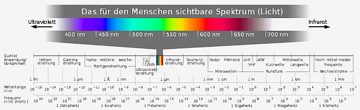
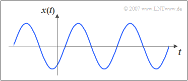

# openUC2 *Spectrometer*
---

This repository will help you to build and setup a simple *Spectrometer*.

*DESCRIBE WHAT IT DOES AND WHAT IT IS FOR.*

Curious to see what this looks like? Keep scrolling!

*INCLUDE A NICE PICTURE AND/OR SCHEME.*

The overall price is in the range *OF LESS THAT A ZILLION*.

***Features:***
* IT MOVES?!
* IT TAKES IMAGES?!
* IT DOES YOUR LAUNDRY?!

## In-Action
*SHARE YOUR FANCY GIF HERE. IT MOVES!*

# Software
*HOW DO I CONTROL THIS THING?*

## Custom Python code *IF APPLICABLE*
We also provide a code example for driving the device using a python driver. Please refer to the code and the package in the folder [PYTHON](./PYTHON).

## *CUSTOM FANCY SOFTWARE*
We also provide *SOME SORCERY* for driving the device. Find the files in folder [*MY_AWESOME_SOFTWARE*]().

# Hardware

Below we describe how the device can be build and assembled in order to replicate the whole system as shown in the rendering above. One needs additional parts that can be found in the core [openUC2 repository](https://github.com/bionanoimaging/UC2-GIT).

## Bill of material

Below you will find all components necessary to build this device

### 3D printing files

All these files need to be printed. We used a Prusa i3 MK3 using PLA Prusament (Galaxy Black) at layer height x.x mm and infill xx%.

|  Type | Details  |  Price | Link  |
|---|---|---|---|
| *FANCY* Holder |  *IT HOLD OTHER FANCY PARTS* |  x,xx € | [Part.stl](./STL/)  |

### Additional parts
This is used in the current version of the setup

|  Type | Details  |  Price | Link  |
|---|---|---|---|
| *FANCY* Part | *IT DOES SOME MAGIC* |  xx € | [My favourite online shop]()  |

### Design files
The original design files are in the [INVENTOR](./INVENTOR) folder. *FOR ANOTHER FORMAT, GET YOUR OWN FOLDER.*

### Electronics
*THE FANCY ELECTRONICS TO RUN THE MOTOR! ...OR WHATEVER YOU USE THERE.*

### Assembly of the DEVICE

***1.*** *These are the parts needed for the DEVICE*

***2.*** *Start by ...*

***2.*** *Continue with ...*

***2.*** *DONE! LOOK AT THE BEAUTY!*

## Showcase
*AWESOME RESULTS!*

***Fig 1.*** *MY MOST AWSOME IMAGE*

# Introduction to Spectroscopy

- Science of the interaction between light and matter
- Decomposition of an input quantity and sorting along a scale
- Investigates at which frequencies/wavelengths a substance can absorb (absorb) or emit (emit) energy in the form of light quanta or electromagnetic waves
- Used to study the properties of radiation itself. 

**Light plays a major role here:**

General: Radiation perceptible by the human eye. 

- Are electromagnetic rays with a wavelength between approx. 400 and 800 nm. 
- Waves with a wavelength of 400 nm are perceived as violet. 
- With increasing wavelength, colours of the rainbow are seen via blue, green, yellow, orange, red, up to red-violet at 800nm. 
- Range of the electromagnetic spectrum is also called the "VIS" (optical window)

image001.png
image002.jpg
image003.png
image004.jpg
image005.png
image006.jpg
image007.png
image008.jpg
image009.jpg
image010.jpg
image011.jpg
image012.jpg
image013.jpg
image014.jpg
image015.jpg
image016.jpg
image017.jpg
image018.jpg
image019.jpg
image020.jpg
image021.jpg
image022.jpg
image023.jpg
image024.jpg
spectrum-02-12-2021-08/27/23.jpg

- high wavelengths, low energy = infrared light (IR)
- short wavelengths, high energy = ultraviolet light (UV)

### Matter

- Everything material that surrounds us (gaseous, liquid and solid). 
- When radiation hits matter it acts as an obstacle and the radiation is either absorbed (swallowed), transmitted (let through) or reflected (thrown back)

### Oscillation:

- Any periodically recurring process
- Sinusoidal oscillation (harmonic oscillation)
- Sensory impression white means that our eye receives all wavelengths of the "VIS 
- Body black, absorbs electromagnetic radiation (heating of the body)
- Each wavelength is assigned a colour, eye no longer sees white, but colour of residual light
-> pairs of colours are called complementary colours

## Spectrometer:

- Device for displaying a spectrum 
-> Measuring spectra 

## Construction:

- Light source 
- Monochromator 
- Sample (cuvette) 
- detector 

## Grating order:

- Laser beam is directed onto a grating (e.g. blank DVD) which has previously been freed from a reflective layer. 
- Beam of zero order n=0, sine(alpha)=0 appears in the centre of an oblique screen.
->beam passes grating without change of direction, independent of wavelength (lambda)
- Further reflections appear above and below (1 and -1order)

## Build your own spectrometer using 3D printing technology:

**Needed:**

- Light source (torch)
- Slit (to "catch" a 1st order beam) 
- lens 
- grating
- Lens + camera 

- No extra lens was used in this experiment
-> camera lens
- Darken camera 
-> 3D parts used, magnets and screws 

- After darkening the spectrometer, the spectrum can be seen on the laptop (via software).
- Calibration 
- First measurements with a torch 

- With red LED 
- With green LED 

## Get Involved

This project is open so that anyone can get involved. You don't even have to learn CAD designing or programming. Find ways you can contribute in  [CONTRIBUTING](https://github.com/openUC2/UC2-GIT/blob/master/CONTRIBUTING.md)

## License and Collaboration

This project is open-source and is released under the CERN open hardware license. Our aim is to make the kits commercially available.
We encourage everyone who is using our Toolbox to share their results and ideas, so that the Toolbox keeps improving. It should serve as a easy-to-use and easy-to-access general purpose building block solution for the area of STEAM education. All the design files are generally for free, but we would like to hear from you how is it going.

You're free to fork the project and enhance it. If you have any suggestions to improve it or add any additional functions make a pull-request or file an issue.

Please find the type of licenses [here](https://github.com/openUC2/UC2-GIT/blob/master/License.md)

REMARK: All files have been designed using Autodesk Inventor 2019 (EDUCATION)

## Collaborating
If you find this project useful, please like this repository, follow us on Twitter and cite the webpage! :-)

