

# openUC2 *Spectrometer*
---

This repository will help you to build and setup a simple *Spectrometer*.

## Bill of material

Below you will find all components necessary to build this device

### 3D printing files

All these files need to be printed. We used a Prusa i3 MK3 using PLA Prusament (Galaxy Black) at layer height x.x mm and infill xx%.

|  Type | Details  |  Price | Link  |
|---|---|---|---|
| *FANCY* Holder |  *IT HOLD OTHER FANCY PARTS* |  x,xx € | [Part.stl](./STL/)  |

# Introduction to Spectroscopy

- Science of the interaction between light and matter
- Decomposition of an input quantity and sorting along a scale
- Investigates at which frequencies/wavelengths a substance can absorb (absorb) or emit (emit) energy in the form of light quanta or electromagnetic waves
- Used to study the properties of radiation itself.

*Fig 1.: Visible Spectrum*

**Light plays a major role here:**

General: Radiation perceptible by the human eye.

- Are electromagnetic rays with a wavelength between approx. 400 and 800 nm.
- Waves with a wavelength of 400 nm are perceived as violet.
- With increasing wavelength, colours of the rainbow are seen via blue, green, yellow, orange, red, up to red-violet at 800nm.
- Range of the electromagnetic spectrum is also called the "VIS" (optical window)

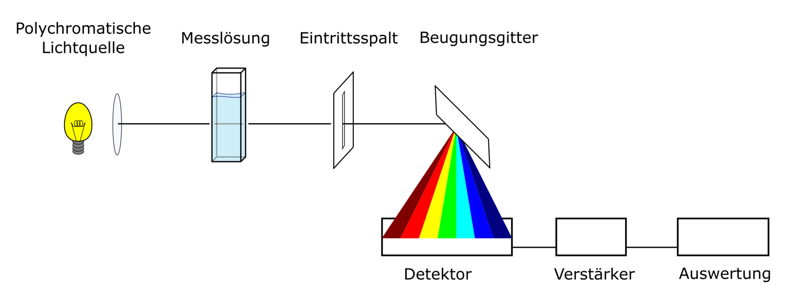
*Fig 3: Absorption Spectroscopy*

- high wavelengths, low energy = infrared light (IR)
- short wavelengths, high energy = ultraviolet light (UV)

### Matter

- Everything material that surrounds us (gaseous, liquid and solid).
- When radiation hits matter it acts as an obstacle and the radiation is either absorbed (swallowed), transmitted (let through) or reflected (thrown back)

### Oscillation:

- Any periodically recurring process
- Sinusoidal oscillation (harmonic oscillation)
- Sensory impression white means that our eye receives all wavelengths of the "VIS
- Body black, absorbs electromagnetic radiation (heating of the body)
- Each wavelength is assigned a colour, eye no longer sees white, but colour of residual light
-> pairs of colours are called complementary colours

*Fig 2: Light-wave as a sine wave*

## Spectrometer:

- Device for displaying a spectrum
-> Measuring spectra

## Construction:

- Light source
- Monochromator
- Sample (cuvette)
- detector

## Grating order:

- Laser beam is directed onto a grating (e.g. blank DVD) which has previously been freed from a reflective layer.
- Beam of zero order n=0, sine(alpha)=0 appears in the centre of an oblique screen.
->beam passes grating without change of direction, independent of wavelength (lambda)
- Further reflections appear above and below (1 and -1order)

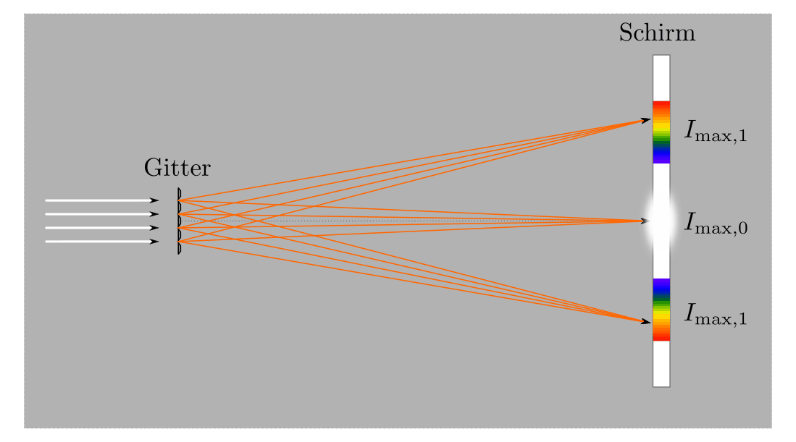
*Fig 4: Diffraction at a grating*

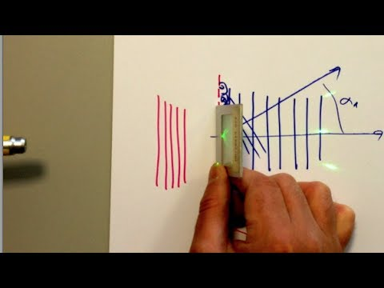
*Fig 5: Diffraction at a grating with a real grating*

## Build your own spectrometer using 3D printing technology:

**Needed:**

- Light source (torch)
- Slit (to "catch" a 1st order beam)
- lens
- grating
- Lens + camera

## Assembly

- No extra lens was used in this experiment
-> camera lens
- Darken camera
-> 3D parts used, magnets and screws

### Step by Step instructions with images

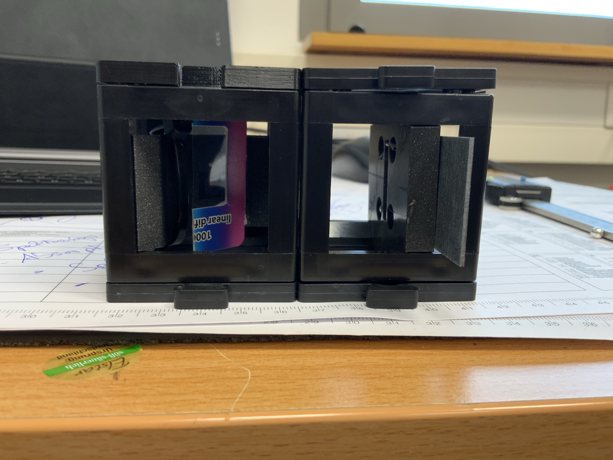
*1. Right: Variable Entrance Slit, Left: Diagnoal Camera + Grating*

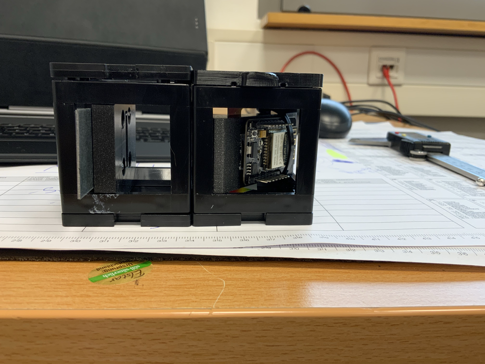
*2. Right: ESP32 Camera for the detection of the diffracted light*

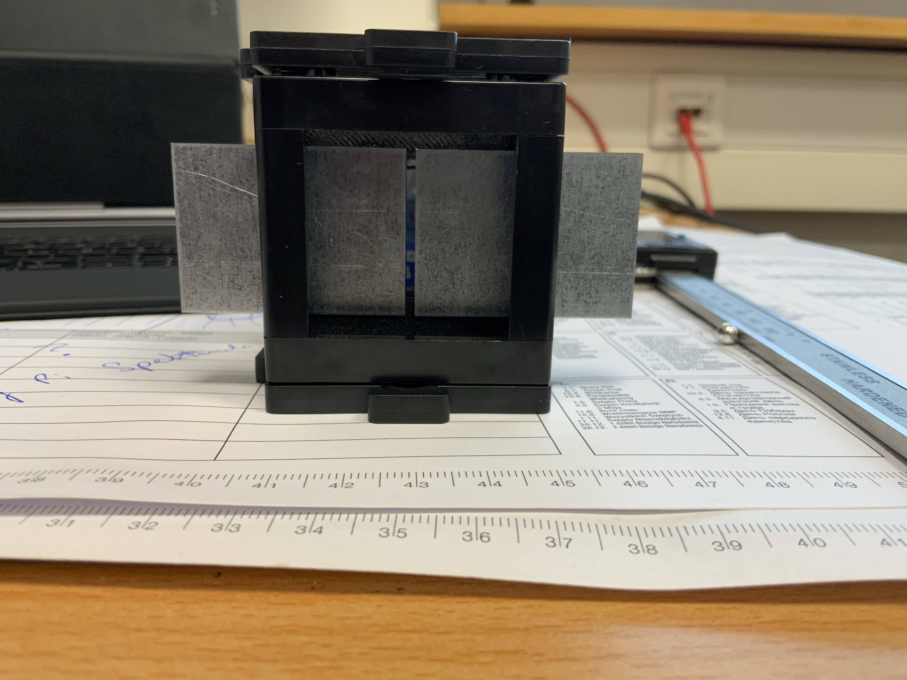
*3. Front view of the magnetically mounted entrance slit*

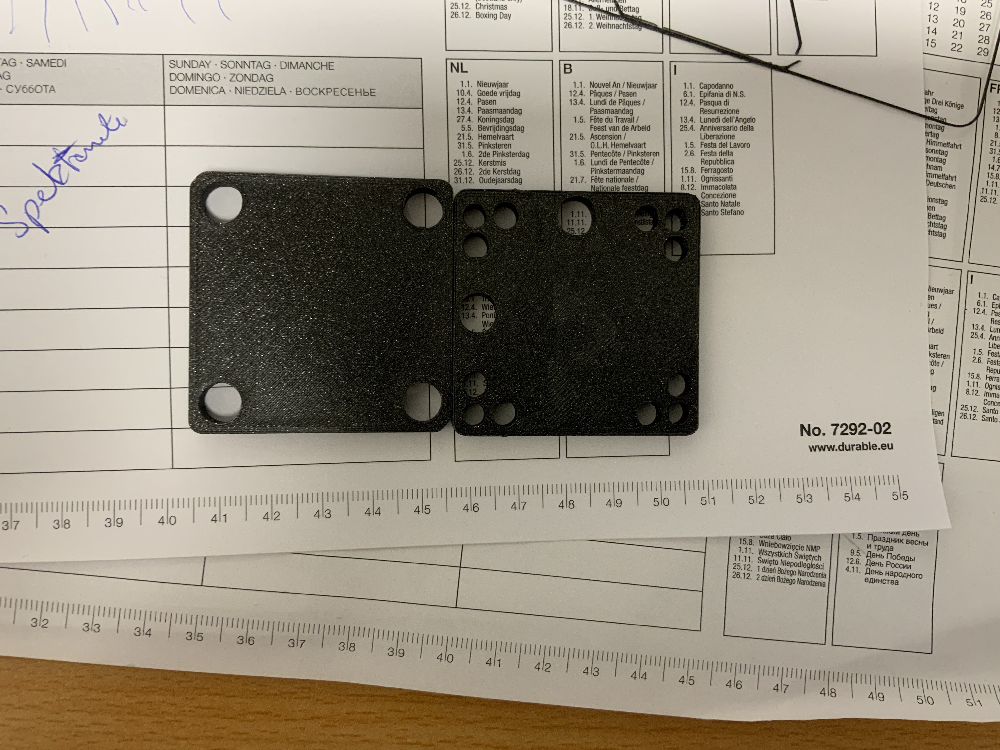
*4. Side covers to block straylight*

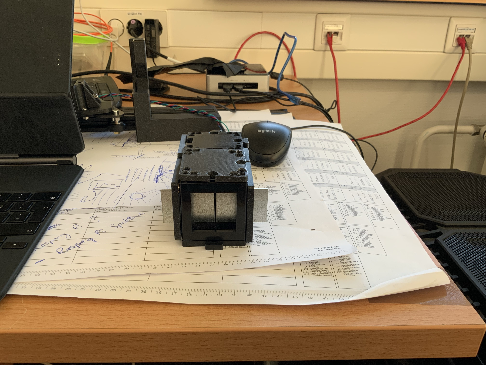
*5. Fully assembled Spectrometer*

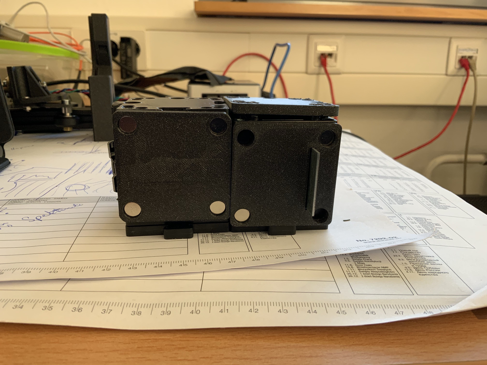
*6. Fully covered Spectrometer*

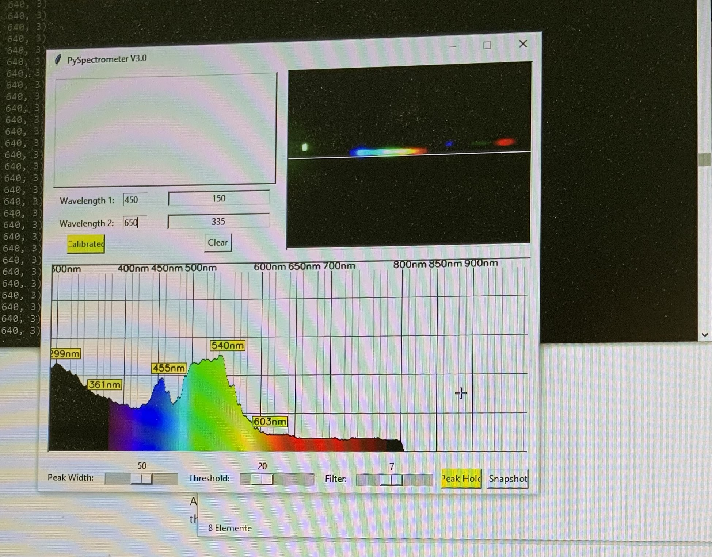
*7. Python Programm to convert the lineplot into a spectrum - See folder [PYTHON](./PYTHON)*

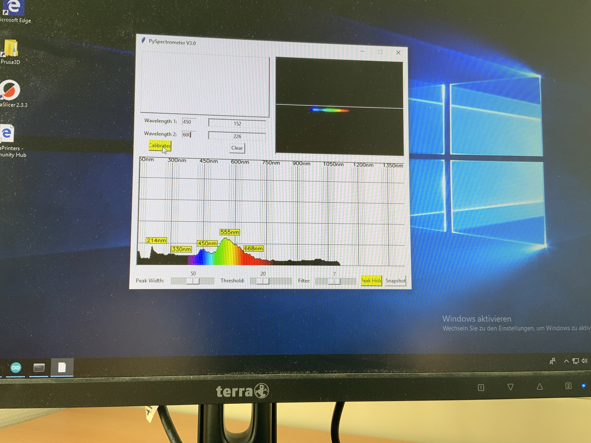
*8. Example Plot of a spectrum (white light)*

## Operation

- After darkening the spectrometer, the spectrum can be seen on the laptop (via software).
- Calibration
- First measurements with a torch

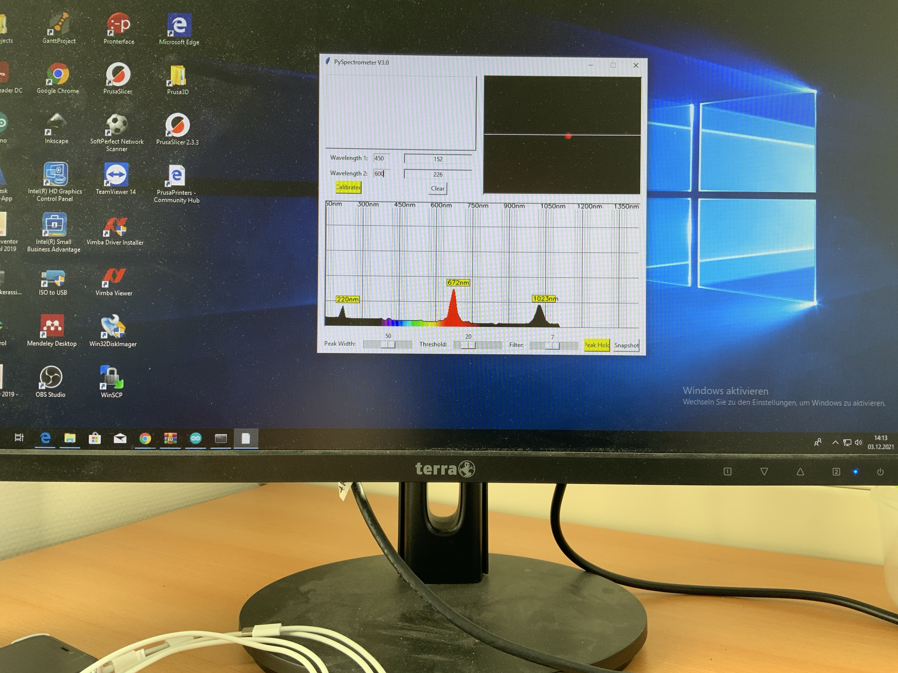
*10. Example Plot of a spectrum (red LED)*

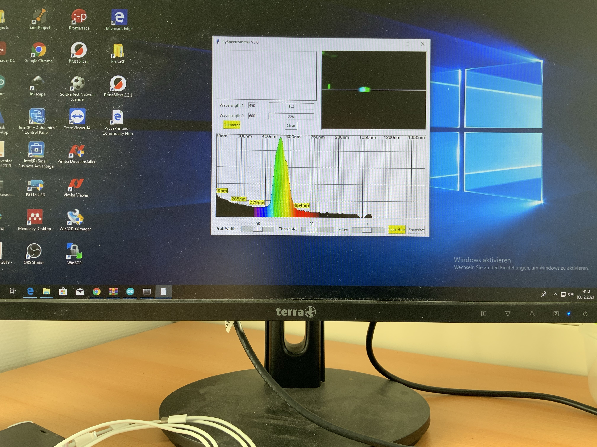
*10. Example Plot of a spectrum (green LED)*

## Further Reading

Public Lab: https://publiclab.org/wiki/spectrometry

Gaudi Lab: https://www.gaudi.ch/GaudiLabs/?page_id=825

ESPectrometer: https://matchboxscope.github.io/docs/Variants/ESPectrometer

## Get Involved

This project is open so that anyone can get involved. You don't even have to learn CAD designing or programming. Find ways you can contribute in  [CONTRIBUTING](https://github.com/openUC2/UC2-GIT/blob/master/CONTRIBUTING.md)

## License and Collaboration

This project is open-source and is released under the CERN open hardware license. Our aim is to make the kits commercially available.
We encourage everyone who is using our Toolbox to share their results and ideas, so that the Toolbox keeps improving. It should serve as a easy-to-use and easy-to-access general purpose building block solution for the area of STEAM education. All the design files are generally for free, but we would like to hear from you how is it going.

You're free to fork the project and enhance it. If you have any suggestions to improve it or add any additional functions make a pull-request or file an issue.

Please find the type of licenses [here](https://github.com/openUC2/UC2-GIT/blob/master/License.md)

REMARK: All files have been designed using Autodesk Inventor 2019 (EDUCATION)

## Collaborating
If you find this project useful, please like this repository, follow us on Twitter and cite the webpage! :-)
